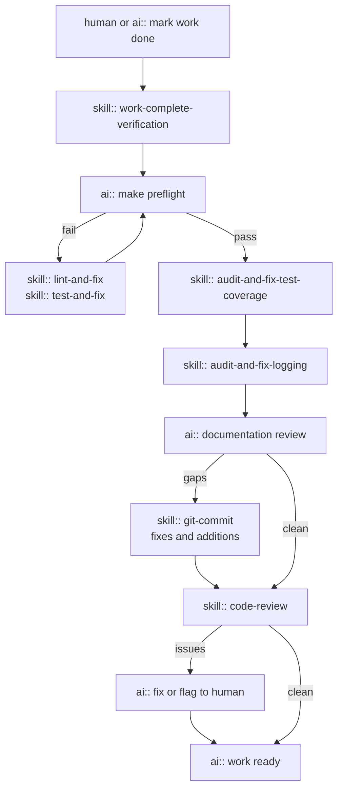
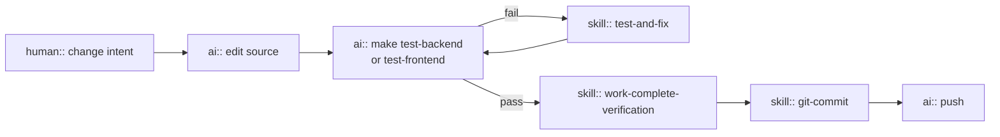
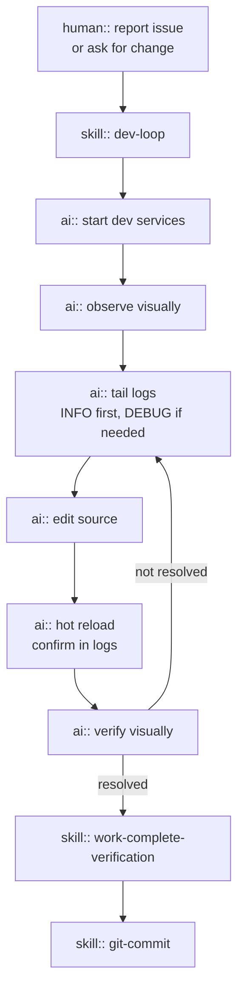
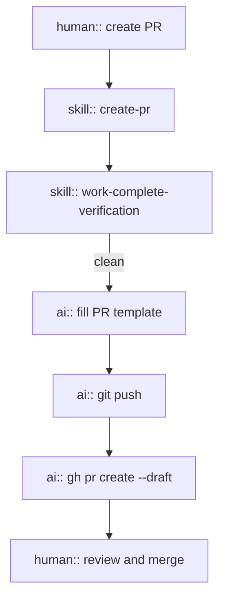
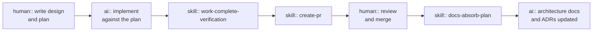

# README-META

> [!NOTE] **This file is the only file in this repository written from a meta perspective.**
> Everything else belongs to the example project itself.

## What This Repo Is

`ai-golden-repo` is a reference implementation showing how AI infrastructure can be woven into a real software project at GoPro. The example project is deliberately trivial — the point is the infrastructure around it, not the code.

Use this repo as a template and a conversation starter: fork it, adapt the tooling, and carry the patterns into your own team's work.

### Who This Is For

Engineers and team leads who want to adopt AI-assisted development practices. This repo gives you a concrete, working example to study, fork, and adapt — not a theoretical framework.

## Guiding Principles

**Harness agnostic.** The patterns here — entry points, runbooks, unified commands, test layers — work with any AI coding tool. Avoid baking in tool-specific syntax where a general convention serves equally well.

**Living docs only.** `AGENTS.md` and runbooks stay in sync with the code. Historical plans and one-time decisions don't belong here.

**Earn your prose.** Every sentence in an agent-facing file should help an agent act correctly. Remove anything that doesn't.

**Self-healing infrastructure.** Operational runbooks improve through use. When an agent encounters a situation a runbook doesn't handle, it resolves the immediate problem, proposes a concrete update, and asks for approval before applying it. The runbook gets better every time it falls short.

## How to Use This Repo

Study the AI infrastructure files alongside the trivial application code. The application is intentionally simple so the infrastructure patterns are visible without noise.

Carry the patterns into your own team's repo:
- Add an `AGENTS.md` oriented to your project's layout and conventions
- Add operational runbooks for recurring or high-stakes workflows
- Consolidate commands behind `make` (or your team's equivalent)
- Ensure your test layers can each be invoked in a single command

> [!NOTE] Future work may make templates or AI driven bootstrapping from this repo.

### Where AI is actively aiding

This repo treats the following engineering concerns as first-class participants in AI-assisted development. Each has defined conventions, tooling, and skills that let an agent act on it with the same discipline a senior engineer would.

**Documentation** — living architecture docs, Architecture Decision Records, and a plan lifecycle that moves from design through implementation to absorption into canonical docs. AI keeps docs in sync with code, not as an afterthought.

**Testing** — a three-layer strategy (unit, component, end-to-end) with explicit definitions of what makes a test valuable. AI audits coverage on every branch, writes missing tests, and never deletes existing ones without authorization.

**Logging** — a first-class design concern, not something added when debugging starts. AI audits new and changed code for appropriate log levels and adds what is missing before a PR is opened.

**Code quality** — lint and format checks run as a hard gate before every commit and PR. AI fixes violations automatically where possible and flags what requires human judgment.

**Development workflow** — the full dev loop that enables autonomous agentic debugging / implementation (start services, observe, edit, visually verify in browser, run targeted tests) is a documented skill, not improvised. AI follows it consistently and updates it when it encounters gaps.

**Version control** — commits follow Conventional Commits; PRs follow a structured template with mandatory sections. AI fills both correctly and proposes `.gitmessage` updates when a new scope is needed.

**Issue tracking** — GitHub Issues are used deliberately: bugs found but not fixed, deferred work from PRs, and scope overflow. AI creates them with the right template and label, and only when authorized.

### Agent entry point

`AGENTS.md` orients any AI agent to the repo before it touches a file. It covers the project summary, repo layout, docs-as-code conventions, working flows (normal work, dev loop, plans), verification requirements, issue tracking, logging conventions, and code comment standards. An agent that reads it first can act without asking questions.

#### Code conventions in AGENTS.md

Beyond workflows, `AGENTS.md` records the conventions an agent must follow:
- **Documentation** — living architecture docs, ADRs, etc. Mostly a pointer to the docs README.md. This covers any and all architecural patterns which will be enforced thorough the `review` skill.
- **Logging** — first-class design; level table (verbose → debug → info → warning → error); Python `logging` module with custom `VERBOSE` level; frontend `console.*`
- **Testing** — valuable vs useless test definition; test requirements must not drive production code shape; never delete without permission
- **Linting and formatting** — Ruff (Python) and ESLint + Prettier (JS); `make preflight` is the gate
- **Code comments** — docstrings and JSDoc on all non-private symbols; inline comments only when code cannot speak for itself
- **Issue tracking** — GitHub Issues with label taxonomy and templates via `create-github-issue`

### Operational runbooks

`.agents/skills/` contains focused, step-by-step playbooks for every recurring or high-stakes workflow. Each skill is a markdown file the agent reads on demand; the harness surfaces the right one based on the task.

| Skill | What it does |
|---|---|
| `git-commit` | Commit using Conventional Commits and the project's `.gitmessage` |
| `create-pr` | Run verification, fill the PR template, push, and open the PR via `gh` |
| `audit-and-fix-test-coverage` | Diff the branch, assess test coverage per layer, write missing valuable tests |
| `audit-and-fix-logging` | Audit changed code for appropriate logging, add what is missing |
| `lint-and-fix` | Run lint and format checks, auto-fix, handle residuals |
| `test-and-fix` | Isolate failing tests, fix production code, never delete tests |
| `create-github-issue` | Open a GitHub issue using the right template and label taxonomy |
| `docs-create-adr` | Write an Architecture Decision Record, update the index, cross-link |
| `docs-absorb-plan` | Fold a shipped plan's durable content into living architecture docs and ADRs |
| `docs-refresh` | Repo-wide doc health sweep: fix inaccuracies, remove useless content, fill gaps, absorb plans |
| `work-complete-verification` | Five-step gate before any PR: preflight → coverage → logging → docs review → code review |
| `code-review` | Check changed code against project patterns, architecture docs, and ADRs for violations |

> [!TIP] Where relevant, all skills are self-healing: when an agent encounters a situation a runbook does not handle, it surfaces the gap, proposes a specific update, and asks for approval. Every edge case becomes a permanent improvement.

### Doc-as-code and Assisted Maintenance

`docs/` follows the living-vs-historical convention: `docs/architecture/` and `docs/adr/` stay in sync with the code; `docs/plans/` is append-only historical record. The `docs/README.md` defines what goes where and the conventions for prose, diagrams, and links.

Skills exist to maintain the docs: `docs-refresh` sweeps the repo for inaccuracies, gaps, and useless content; `docs-absorb-plan` folds a shipped plan's durable content into living docs; `docs-create-adr` creates a new ADR and updates the index.

### Structured PR workflow

`.github/PULL_REQUEST_TEMPLATE.md` enforces a consistent review checklist: summary, changes by area, testing (all `make` targets explicitly checked), docs and architecture review (architecture updated? ADR added? docstrings present? deferred work tracked?).

## Workflow diagrams

Node labels are prefixed to show who or what is acting:
`human::` — requires a person · `skill::` — agent invokes a named skill · `ai::` — agent acts with general capabilities

### Verify before completing work

A common chokepoint that an agent should use to verify its work is complete.

### Freeform Human Initiated Work

A human conversationally chatting with an agent, asking for informal changes.

### Iterative Full Agentic Dev Loop

A human giving an agent a free form task and full control to implement and verify it in realtime. Agent can iterate,
viewing logs and visual output until complete.

### Create a pull request

### Plan lifecycle

