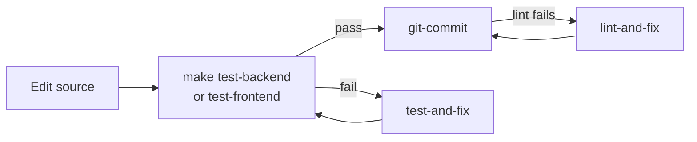
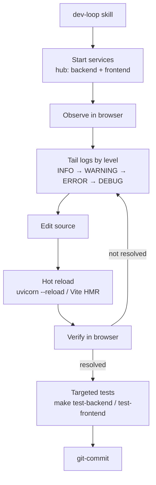
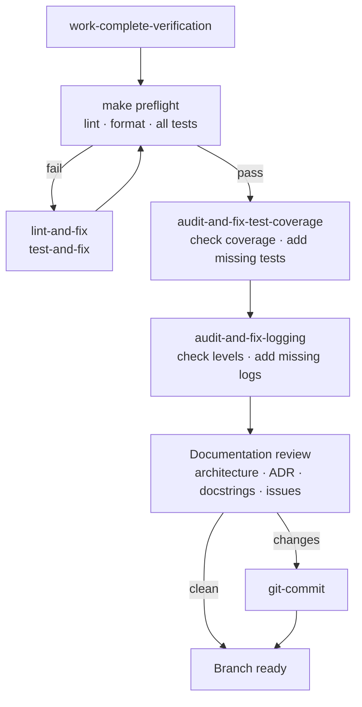
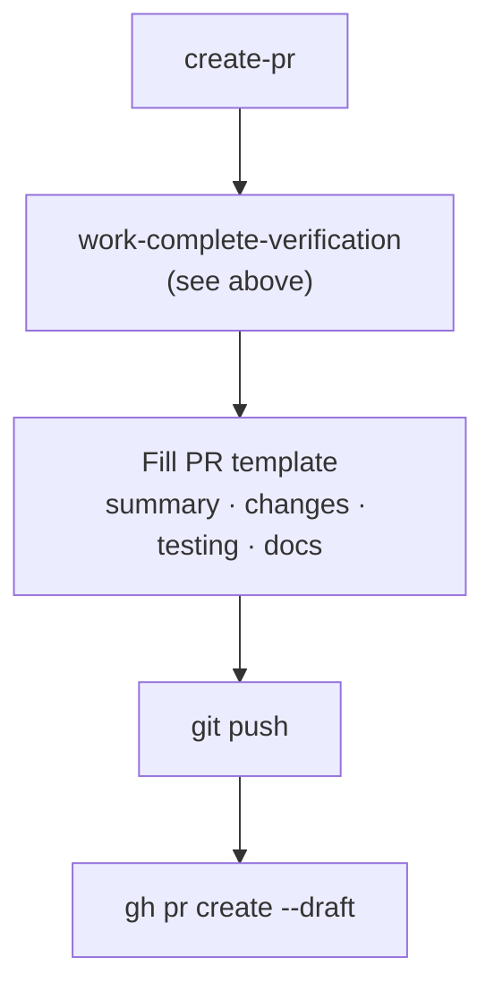
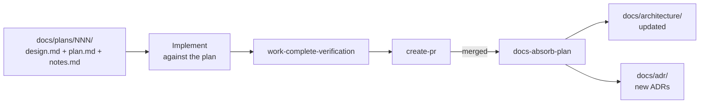

# README-META

> [!NOTE] **This file is the only file in this repository written from a meta perspective.**
> Everything else belongs to the example project itself.

## What This Repo Is

`ai-golden-repo` is a reference implementation showing how AI infrastructure can be woven into a real software project at GoPro. The example project is deliberately trivial — the point is the infrastructure around it, not the code.

Use this repo as a template and a conversation starter: fork it, adapt the tooling, and carry the patterns into your own team's work.

## What "AI Infrastructure" Means Here

AI infrastructure is the set of files, conventions, and workflows that make a codebase legible and actionable to an AI agent — regardless of which AI tool or harness your team uses.

This repo demonstrates the following patterns, all present and working:

### Agent entry point

`AGENTS.md` orients any AI agent to the repo before it touches a file. It covers the project summary, repo layout, docs-as-code conventions, working flows (normal work, dev loop, plans), verification requirements, issue tracking, logging conventions, and code comment standards. An agent that reads it first can act without asking questions.

### Operational runbooks

`.agents/skills/` contains focused, step-by-step playbooks for every recurring or high-stakes workflow. Each skill is a markdown file the agent reads on demand; the harness surfaces the right one based on the task.

| Skill | What it does |
|---|---|
| `dev-loop` | Start services, observe live behavior, edit, verify in browser, run targeted tests |
| `git-commit` | Commit using Conventional Commits and the project's `.gitmessage` |
| `create-pr` | Run verification, fill the PR template, push, and open the PR via `gh` |
| `work-complete-verification` | Four-step gate before any PR: preflight → coverage → logging → docs review |
| `audit-and-fix-test-coverage` | Diff the branch, assess test coverage per layer, write missing valuable tests |
| `audit-and-fix-logging` | Audit changed code for appropriate logging, add what is missing |
| `lint-and-fix` | Run lint and format checks, auto-fix, handle residuals |
| `test-and-fix` | Isolate failing tests, fix production code, never delete tests |
| `create-github-issue` | Open a GitHub issue using the right template and label taxonomy |
| `docs-create-adr` | Write an Architecture Decision Record, update the index, cross-link |
| `docs-absorb-plan` | Fold a shipped plan's durable content into living architecture docs and ADRs |
| `docs-refresh` | Repo-wide doc health sweep: fix inaccuracies, remove useless content, fill gaps, absorb plans |

All skills are self-healing: when an agent encounters a situation a runbook does not handle, it surfaces the gap, proposes a specific update, and asks for approval. Every edge case becomes a permanent improvement.

### Unified command surface

`Makefile` is the single, documented entry point for every lifecycle action. Run `make` to see all available goals. Runbooks and docs reference `make` targets rather than repeating raw commands — when a command changes, one place changes.

| Goal | Purpose |
|---|---|
| `make dev` / `make prod` | Start dev (hot reload) or production (Docker) stack |
| `make test-backend` / `make test-frontend` / `make test-e2e` | Run individual test layers |
| `make preflight` | Full gate: lint + format + all tests |
| `make lint` / `make lint-fix` | Lint check or auto-fix (Ruff + ESLint) |
| `make format` / `make format-fix` | Format check or auto-fix (Ruff + Prettier) |
| `make openapi` / `make openapi-preview` | Regenerate or preview the API spec (Redoc) |

### Layered tests with CI

Three independent test layers — backend unit (pytest + httpx), frontend unit (Vitest + React Testing Library), and end-to-end (Playwright) — each runnable with a single `make` command. Playwright manages its own service lifecycle so E2E runs cleanly in CI without manual setup.

A GitHub Actions workflow runs `make preflight` on every pull request.

### Doc-as-code

`docs/` follows the living-vs-historical convention: `docs/architecture/` and `docs/adr/` stay in sync with the code; `docs/plans/` is append-only historical record. The `docs/README.md` defines what goes where and the conventions for prose, diagrams, and links.

`docs/specs/openapi.json` is generated from FastAPI route definitions and Pydantic models via `make openapi` — the API spec is always derived from code, never hand-maintained.

### Structured PR workflow

`.github/PULL_REQUEST_TEMPLATE.md` enforces a consistent review checklist: summary, changes by area, testing (all `make` targets explicitly checked), docs and architecture review (architecture updated? ADR added? docstrings present? deferred work tracked?).

### Code conventions in AGENTS.md

Beyond workflows, `AGENTS.md` records the conventions an agent must follow:
- **Logging** — first-class design; level table (verbose → debug → info → warning → error); Python `logging` module with custom `VERBOSE` level; frontend `console.*`
- **Testing** — valuable vs useless test definition; test requirements must not drive production code shape; never delete without permission
- **Linting and formatting** — Ruff (Python) and ESLint + Prettier (JS); `make preflight` is the gate
- **Code comments** — docstrings and JSDoc on all non-private symbols; inline comments only when code cannot speak for itself
- **Issue tracking** — GitHub Issues with label taxonomy and templates via `create-github-issue`

## Workflow diagrams

### Normal work

Edit source, run the narrowest test layer, commit. Lint and test repair skills handle failures without breaking the flow.

### Full dev loop

Used when live behavior must be observed — a rendering issue, a bug only visible in the browser, or a hot-reload edge case.

### Verify before completing work

Four steps run in order. Each must be clean before the next begins.

### Create a pull request

Verification runs first. The PR is opened only when the branch is fully clean.

### Plan lifecycle

Plans capture design before implementation. Once the work ships, durable content moves into living docs.

## Who This Is For

Engineers and team leads who want to adopt AI-assisted development practices. This repo gives you a concrete, working example to study, fork, and adapt — not a theoretical framework.

## How to Use This Repo

Study the AI infrastructure files alongside the trivial application code. The application is intentionally simple so the infrastructure patterns are visible without noise.

Carry the patterns into your own team's repo:
- Add an `AGENTS.md` oriented to your project's layout and conventions
- Add operational runbooks for recurring or high-stakes workflows
- Consolidate commands behind `make` (or your team's equivalent)
- Ensure your test layers can each be invoked in a single command

## Guiding Principles

**Harness agnostic.** The patterns here — entry points, runbooks, unified commands, test layers — work with any AI coding tool. Avoid baking in tool-specific syntax where a general convention serves equally well.

**One source of truth.** Runbooks and docs reference `make` targets; they don't repeat raw commands. When a command changes, one place changes.

**Living docs only.** `AGENTS.md` and runbooks stay in sync with the code. Historical plans and one-time decisions don't belong here.

**Earn your prose.** Every sentence in an agent-facing file should help an agent act correctly. Remove anything that doesn't.

**Self-healing infrastructure.** Operational runbooks improve through use. When an agent encounters a situation a runbook doesn't handle, it resolves the immediate problem, proposes a concrete update, and asks for approval before applying it. The runbook gets better every time it falls short.
