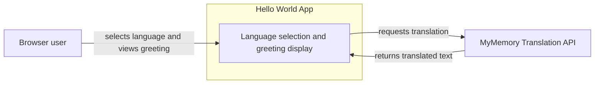

# 01 System Context

This C4 L1 view treats Hello World as one system at its external boundary.

Hello World is a multilingual web application. A browser user chooses a language and reads a dynamically translated "Hello, World!" greeting. The application owns its curated language choices and delegates translation text to MyMemory.

## User workflow

A browser user opens the application. The application selects a default from the browser locale, allows the user to choose another supported language, and displays one translated greeting.

## Diagram

## Boundary

The application stores curated language metadata but does not store translated greeting text. Its backend owns the MyMemory integration, timeout, response validation, and application-facing errors. The browser does not call MyMemory directly.

The application does not use a database or persist user state. See [02 Containers](02-containers.md) for the separately running frontend and backend units.

## Related decision

[ADR-0001](../adr/0001-translations-from-external-api.md) records why translation text moved from repository data to an external API.
