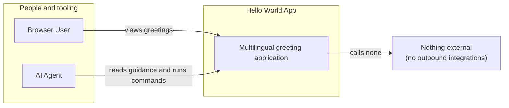

# 01 System Context

This C4 L1 view treats Hello World as one system at its external boundary.

Hello World is a multilingual web application used at GoPro as a reference for
AI-assisted development patterns. It serves a browser-readable set of static
greetings and is deliberately self-contained so its development workflow can be
understood without an external integration.

## Users and workflows

### Browser User

A Browser User opens the application and reads its greetings in the browser. The
application supplies both the presentation and the static data behind it.

### AI Agent

An AI Agent begins with [AGENTS.md](../../AGENTS.md) to orient itself to the
repository, service-control `hub` commands, API contract, and available skills.
It uses [Makefile](../../Makefile) targets as the command surface and can follow
the [dev-loop skill](../../.agents/skills/dev-loop/SKILL.md) to develop,
observe, and correct a running application.

## Diagram

## Boundary

The application serves static greeting data. It does not call external APIs, use
a database, or persist state. Its only data source is bundled with the
application and is loaded for serving; there are no external systems beyond the
system boundary shown above.

For the separately running frontend and backend units inside this boundary, see
[02 Containers](02-containers.md).