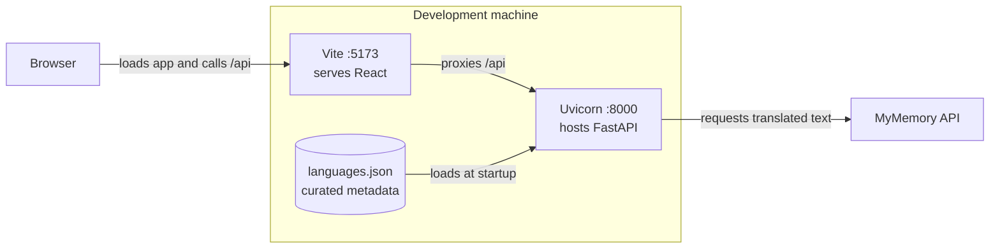
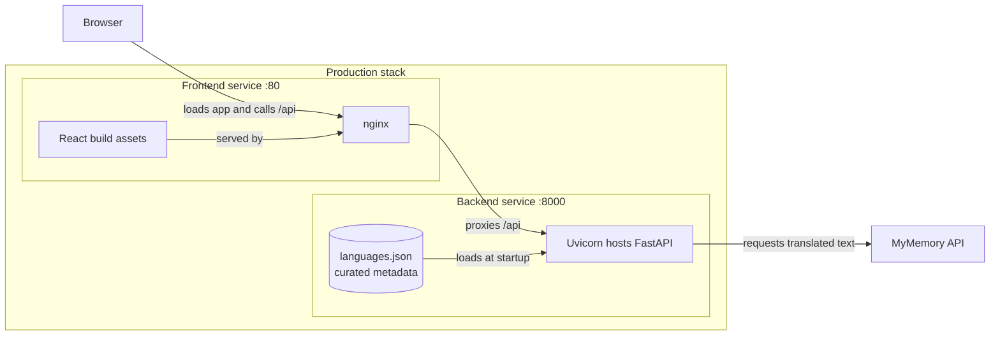

# 02 Containers

This C4 L2 view expands the application boundary in [01 System Context](01-system-context.md). The browser-facing frontend and FastAPI backend run as distinct units. Curated language metadata travels with the backend deployment and is loaded into memory at startup; translated text comes from MyMemory on demand.

## Development topology

In development, Vite serves the React application on `:5173`. Its [configuration](../../frontend/vite.config.js) forwards `/api/*` to `http://localhost:8000/api/*`, where Uvicorn serves the backend.

The metadata source is [`backend/data/languages.json`](../../backend/data/languages.json). Changing it requires a backend reload before the in-memory language collection changes.

## Production topology

In production, [Docker Compose](../../docker-compose.yml) runs the frontend and backend services. The [frontend image](../../frontend/Dockerfile) builds the React application, then nginx serves that build on `:80` and proxies `/api/` to `backend:8000`.

Both proxy paths hide the backend's network location from the browser. The backend owns the curated language list and external translation boundary. Neither topology introduces a database.

## API boundary

Both proxy paths carry the REST contract documented in [03 API](03-api.md).

## Related decision

[ADR-0001](../adr/0001-translations-from-external-api.md) records why translation text is queried externally while language metadata remains local.
