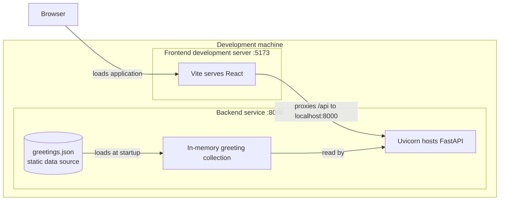
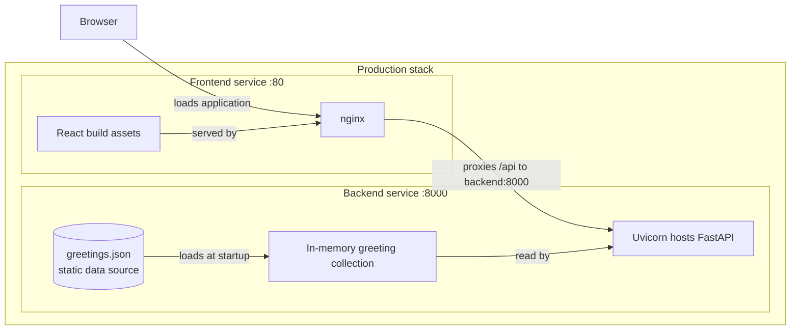

# 02 Containers

This C4 L2 view expands the application boundary in
[01 System Context](01-system-context.md). The browser-facing frontend and the
FastAPI backend run as distinct units. The static greeting file travels with the
backend deployment, is loaded into memory at startup, and is not a database.

## Development topology

In development, Vite serves the React application on `:5173`. Its
[configuration](../../frontend/vite.config.js) forwards `/api/*` to
`http://localhost:8000/api/*`, where Uvicorn serves the backend.

The data source is
[`backend/data/greetings.json`](../../backend/data/greetings.json). Updating it
requires a backend restart before the startup-loaded collection changes.

## Production topology

In production, [Docker Compose](../../docker-compose.yml) runs the frontend and
backend services. The [frontend image](../../frontend/Dockerfile) builds the
React application, then nginx serves that build on `:80`. nginx uses its
[production configuration](../../docker/nginx.conf) to proxy `/api/` requests
to `backend:8000`.

The frontend proxy hides the backend's network location from the browser while
the backend remains the owner of the greeting data. Neither topology introduces
a database.

## API boundary

Both proxy paths carry the REST contract documented in
[03 API](03-api.md). That document is the next level of detail for frontend-to-
backend requests and responses.

## Related decisions

- [ADR-0001: Static JSON data source](../adr/0001-json-data-source.md) records
  why greeting data is stored in a file and loaded into memory.
- [ADR-0002: Layered test strategy](../adr/0002-layered-test-strategy.md)
  records the test entry points associated with the frontend and backend
  boundaries.