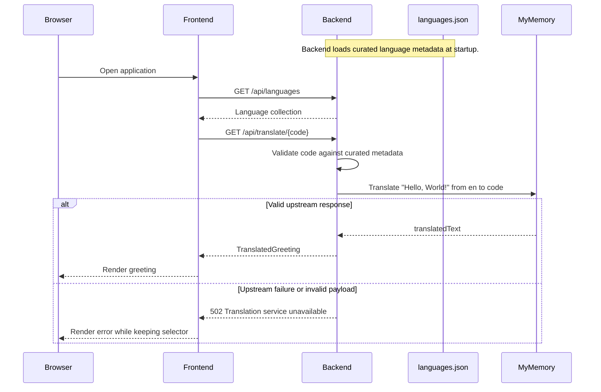

# 03 API

This API layer describes the frontend-to-backend boundary introduced in [02 Containers](02-containers.md), within the application described in [01 System Context](01-system-context.md).

## Canonical specification

The canonical HTTP schema is [`docs/specs/openapi.json`](../specs/openapi.json), generated by `make openapi`. Read that file for complete validation responses and machine-readable schemas; this page summarizes the stable interaction rather than duplicating generated content.

Per-symbol Python detail belongs in docstrings in [the backend application](../../backend/app/main.py).

## Resources

| Method | Path | Successful response | Error response |
| --- | --- | --- | --- |
| `GET` | `/api/languages` | Curated language collection | — |
| `GET` | `/api/translate/{code}` | One translated greeting | `404` unknown code; `502` translation provider failure |

Language codes match the values returned by `/api/languages`. Matching is case-sensitive so the BCP 47 code `zh-CN` is preserved exactly.

## Representations

A Language contains its English name, native-script name, and translation-provider code. A TranslatedGreeting contains those fields plus the dynamic greeting text. The canonical field schemas and descriptions remain in the generated OpenAPI specification.

The backend permits cross-origin requests from any origin, method, and header. Normal frontend traffic uses the proxies described in [02 Containers](02-containers.md).

## Translation flow

Unknown codes are rejected before any external request. MyMemory calls use a bounded timeout. HTTP failures, timeouts, and responses without non-empty translated text map to the same HTTP 502 application error.

## Regenerating the specification

Run `make openapi` from the repository root after changing the FastAPI routes or Pydantic models. The command in [Makefile](../../Makefile) regenerates [`docs/specs/openapi.json`](../specs/openapi.json); do not hand-edit the generated file.

## Related decision

[ADR-0001](../adr/0001-translations-from-external-api.md) records the external translation boundary and the retained curated language list.
