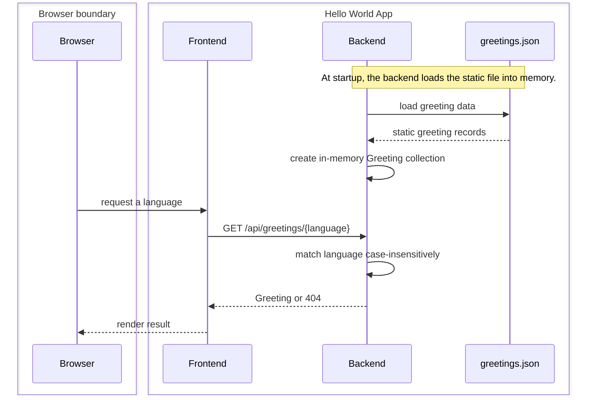

# 03 API

This API layer describes the frontend-to-backend boundary introduced in
[02 Containers](02-containers.md), within the application described in
[01 System Context](01-system-context.md).

## Canonical specification

The canonical HTTP schema is
[`docs/specs/openapi.json`](../specs/openapi.json), generated by `make openapi`. Read that
file for the complete schema, validation responses, and machine-readable
contract; this page intentionally summarizes the stable interaction rather than
copying generated content.

Per-symbol Python detail belongs in the `Greeting` model's docstring in
[the backend application](../../backend/app/main.py), rather than in a
code-level architecture document.

## Resources

| Method | Path | Successful response | Error response |
| --- | --- | --- | --- |
| `GET` | `/api/greetings` | Greeting collection | — |
| `GET` | `/api/greetings/{language}` | One Greeting | `404` when the language is unknown |

The single-greeting lookup matches the English language name
case-insensitively. A request for `japanese`, `Japanese`, or `JAPANESE` resolves
to the same record when it is present.

## Greeting representation

A Greeting identifies a language, its native-language label, and the localized
text. The examples below come from the
[static greeting data](../../backend/data/greetings.json).

| Field | Meaning | Examples |
| --- | --- | --- |
| `language` | English language name used for lookup | `English`, `Japanese` |
| `native_name` | Language name in its own script | `English`, `日本語` |
| `greeting` | Localized Hello World text | `Hello`, `こんにちは` |

The backend permits cross-origin requests from any origin, method, and header.
The normal frontend paths still use the proxies described in
[02 Containers](02-containers.md).

## Single lookup flow

The file exchange occurs at startup, not for every request. Each lookup searches
the memory-resident collection and then returns either its matching Greeting or
the documented `404`.

## Regenerating the specification

Run `make openapi` from the repository root after changing the FastAPI routes or
the Greeting model. The command in [Makefile](../../Makefile) regenerates
[`docs/specs/openapi.json`](../specs/openapi.json); do not hand-edit the generated file.
