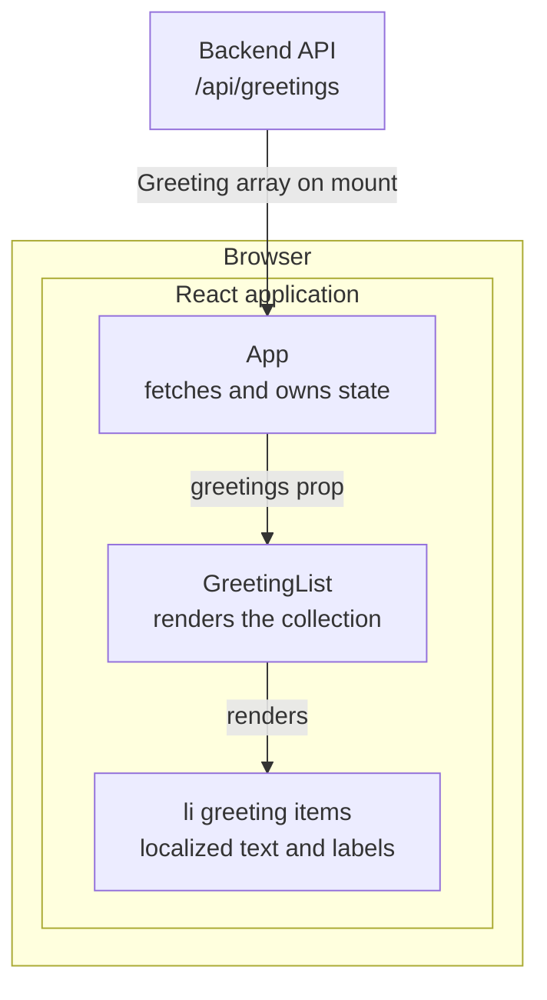

# 04 Frontend

This view builds on the browser-facing frontend and proxy boundaries in
[02 Containers](02-containers.md) and the resource contract in
[03 API](03-api.md).

## Component tree

[App.jsx](../../frontend/src/App.jsx) is the root component. It requests the
greeting collection when it mounts, owns the loading, error, and greeting state,
and passes the received array to
[GreetingList.jsx](../../frontend/src/components/GreetingList.jsx).

GreetingList renders an unordered list by mapping the array it receives. Each
list item presents the localized greeting prominently, followed by the English
language name and native-language label. The JSDoc in
[App.jsx](../../frontend/src/App.jsx) and
[GreetingList.jsx](../../frontend/src/components/GreetingList.jsx) is the
per-component API reference; this page deliberately does not add a code-level
C4 L4 model.

## Data flow and rendered states

App fetches `/api/greetings` on mount. After a successful response, it stores
the received array and forwards it unchanged to GreetingList for rendering.

| State | What App renders |
| --- | --- |
| Request in flight | `Loading greetings...` |
| Request failure | The error message in an element with the alert role |
| Successful response | GreetingList with the received greeting array |

## Development and production routing

In development, the [Vite configuration](../../frontend/vite.config.js) routes
`/api/*` to `http://localhost:8000/api/*`. In production, the
[nginx configuration](../../docker/nginx.conf) handles the same `/api/` path
and proxies it to the backend. App therefore uses the same relative API path in
both environments.

## Test hook

Every rendered list item has `data-testid="greeting-item"`. The
[Vitest component test](../../frontend/tests/GreetingList.test.jsx) queries this
hook by test ID, and the [Playwright specification](../../frontend/e2e/greetings.spec.ts)
uses its matching attribute selector. It is the stable test hook for identifying
greeting items independently of their visible text.

## Extending a display field

1. Add the field to the Greeting model in
   [the backend application](../../backend/app/main.py) and provide it in the
   [static greeting data](../../backend/data/greetings.json).
2. Regenerate the canonical contract with `make openapi`, as described in
   [03 API](03-api.md), then update
   [GreetingList.jsx](../../frontend/src/components/GreetingList.jsx) to consume
   and render the new field. App requires no mapping change because it forwards
   the response array unchanged.
3. Update the relevant
   [Vitest component assertions](../../frontend/tests/GreetingList.test.jsx)
   and [Playwright behavior](../../frontend/e2e/greetings.spec.ts) when the new
   field is part of the visible interface.