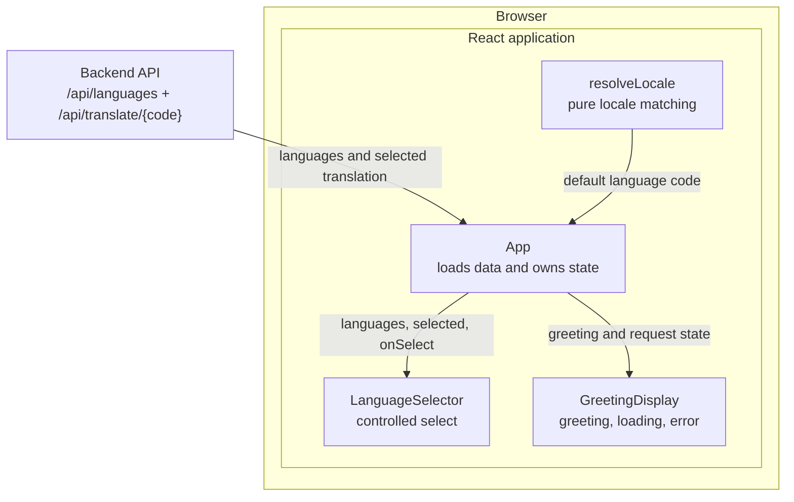

# 04 Frontend

This view builds on the browser-facing frontend and proxy boundaries in [02 Containers](02-containers.md) and the resource contract in [03 API](03-api.md).

## Component tree

[App.jsx](../../frontend/src/App.jsx) owns the language list, selected code, translated greeting, and request states. [LanguageSelector.jsx](../../frontend/src/components/LanguageSelector.jsx) is a controlled dropdown. [GreetingDisplay.jsx](../../frontend/src/components/GreetingDisplay.jsx) renders one prominent greeting or its loading/error state. [locale.js](../../frontend/src/locale.js) maps a browser locale to an available code without reading browser globals itself.

JSDoc on each exported component and function is the per-symbol API reference; this page does not duplicate component signatures.

## Data flow and rendered states

App first fetches `/api/languages`, resolves the default code from `navigator.language`, and then fetches `/api/translate/{code}`. A dropdown selection updates the code and triggers a new translation request.

| State | What App renders |
| --- | --- |
| Language request in flight | `Loading languages...` |
| Language request failure | Top-level alert |
| Translation request in flight | Dropdown plus `Translating...` status |
| Translation request failure | Dropdown plus display alert |
| Translation success | Dropdown plus translated greeting and language labels |

Locale matching prefers an exact code, then the base language. Chinese locale variants map to the curated `zh-CN` code. Unmatched locales fall back to English.

## Development and production routing

In development, the [Vite configuration](../../frontend/vite.config.js) routes `/api/*` to `http://localhost:8000/api/*`. In production, the [nginx configuration](../../docker/nginx.conf) proxies the same relative path to the backend. Components therefore do not know the backend's network location.

## Test hooks

The dropdown carries `data-testid="language-selector"`; the display carries `data-testid="greeting-display"`. Component and Playwright tests use these stable selectors where a semantic role alone does not identify the unit under test.

## Extending a display field

1. Add the field to the appropriate Pydantic response model in [the backend application](../../backend/app/main.py).
2. Regenerate the canonical contract with `make openapi`, as described in [03 API](03-api.md).
3. Pass the field from App to the component that owns its presentation and update that component's JSDoc.
4. Add behavior-focused assertions to the relevant Vitest and Playwright coverage.
