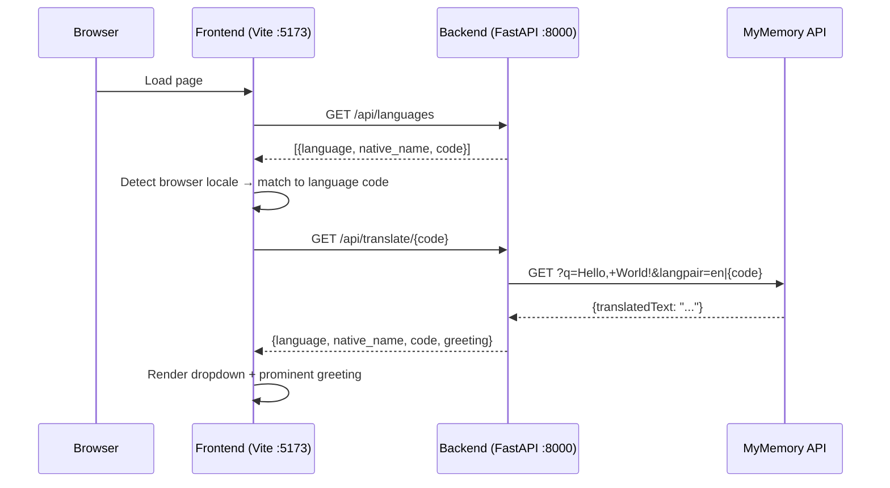

# 001 — Language Dropdown with Dynamic Translations

## Summary

Replace the static greeting list with a language dropdown that shows a single prominent "Hello, World!" greeting in the selected language. Translations are fetched on demand from the MyMemory Translation API. The browser's locale determines the default language selection.

## Architecture



## Data model

### `backend/data/languages.json` (renamed from `greetings.json`)

The static file now stores the curated language list without translations:

```json
[
  {"language": "English", "native_name": "English", "code": "en"},
  {"language": "Spanish", "native_name": "Español", "code": "es"},
  {"language": "French", "native_name": "Français", "code": "fr"},
  {"language": "German", "native_name": "Deutsch", "code": "de"},
  {"language": "Japanese", "native_name": "日本語", "code": "ja"},
  {"language": "Mandarin Chinese", "native_name": "普通话", "code": "zh-CN"},
  {"language": "Arabic", "native_name": "العربية", "code": "ar"},
  {"language": "Portuguese", "native_name": "Português", "code": "pt"},
  {"language": "Russian", "native_name": "Русский", "code": "ru"},
  {"language": "Korean", "native_name": "한국어", "code": "ko"}
]
```

### Pydantic models

```python
class Language(BaseModel):
    language: str     # English name
    native_name: str  # Name in own script
    code: str         # ISO 639-1 code (or BCP 47 for zh-CN)

class TranslatedGreeting(BaseModel):
    language: str
    native_name: str
    code: str
    greeting: str     # "Hello, World!" translated
```

## API changes

### `GET /api/languages`

Returns the curated language list. No external calls.

**Response:** `Language[]`

### `GET /api/translate/{code}`

Calls MyMemory to translate "Hello, World!" into the given language code. Returns the full greeting object.

**Response:** `TranslatedGreeting`

**Error cases:**
- Code not in curated list → 404
- MyMemory API unreachable or returns error → 502 with `{"detail": "Translation service unavailable"}`
- MyMemory returns empty or invalid response → 502

### Removed

`GET /api/greetings` and `GET /api/greetings/{language}` are removed. The new endpoints replace them entirely.

## Frontend changes

### Component structure

```
App
├── LanguageSelector (dropdown)
└── GreetingDisplay (single prominent greeting)
```

### `LanguageSelector`

- Renders a `<select>` element populated from `GET /api/languages`
- Props: `languages: Language[]`, `selected: string` (code), `onSelect: (code) => void`
- `data-testid="language-selector"`

### `GreetingDisplay`

Replaces `GreetingList`. Renders a single greeting prominently:
- The greeting text large and centered
- Language name and native name as subtitle
- `data-testid="greeting-display"`
- Loading state while translation is in flight
- Error state if translation fails

### `App` changes

- On mount: fetch `/api/languages`, detect browser locale via `navigator.language`, match to closest curated language code (e.g. `ja-JP` → `ja`, `zh-TW` → `zh-CN` as fallback, unmatched → `en`)
- On language select: fetch `/api/translate/{code}`, display result
- State: `languages`, `selectedCode`, `greeting`, `isLoading`, `error`

### Locale matching

```
navigator.language → "ja-JP"
                   → strip region → "ja"
                   → exact match in curated codes? → yes → use "ja"
                   → no → try base language → no → fallback to "en"
```

For `zh`: `zh-CN`, `zh-TW`, `zh-HK` all map to `zh-CN` (the only Chinese variant in the curated list).

## Caching

No backend caching in this iteration. MyMemory is fast enough for a demo app with 10 languages. If latency becomes an issue, add an in-memory dict keyed by language code — but not now (YAGNI).

## Error handling

| Scenario | Backend | Frontend |
|---|---|---|
| Unknown language code | 404 | Show error message |
| MyMemory down | 502 | Show "Translation service unavailable" |
| MyMemory returns garbage | 502 | Show "Translation service unavailable" |
| Network error (frontend → backend) | — | Show "Unable to load" (existing pattern) |

## Testing

### Backend

- `test_get_languages`: returns 200, list of 10, each has language/native_name/code
- `test_translate_known_language`: mock MyMemory response, verify 200 + correct shape
- `test_translate_unknown_language`: request code not in list → 404
- `test_translate_api_failure`: mock MyMemory returning error → 502

MyMemory calls are mocked in tests using `httpx` respx or monkeypatching — no live API calls in unit tests.

### Frontend

- `LanguageSelector`: renders all options, fires onSelect on change
- `GreetingDisplay`: renders greeting text, language name, native name; loading state; error state
- `App`: mocks fetch for languages + translate, verifies default language selection from locale

### E2E

- Load page → dropdown visible with 10 options
- Default selection matches a known locale (or English)
- Select a different language → greeting changes
- `data-testid` selectors: `language-selector`, `greeting-display`

## Files changed

| File | Change |
|---|---|
| `backend/data/greetings.json` | Renamed to `languages.json`; drop `greeting`, add `code` |
| `backend/app/main.py` | New models, new routes, MyMemory integration, remove old routes |
| `backend/tests/test_routes.py` | Rewrite for new endpoints with mocked MyMemory |
| `frontend/src/App.jsx` | New state management, locale detection, two-step fetch |
| `frontend/src/components/GreetingList.jsx` | Removed |
| `frontend/src/components/LanguageSelector.jsx` | New |
| `frontend/src/components/GreetingDisplay.jsx` | New |
| `frontend/tests/GreetingList.test.jsx` | Removed |
| `frontend/tests/LanguageSelector.test.jsx` | New |
| `frontend/tests/GreetingDisplay.test.jsx` | New |
| `frontend/e2e/greetings.spec.ts` | Updated for dropdown + single greeting |
| `docs/specs/openapi.json` | Regenerated via `make openapi` |
| `docs/architecture/03-api.md` | Updated for new endpoints |
| `docs/architecture/04-frontend.md` | Updated component tree |
| `docs/adr/0001-translations-from-external-api.md` | New — records the hardcoded → API-query decision |
| `docs/adr/README.md` | Add ADR-0001 to the index |
